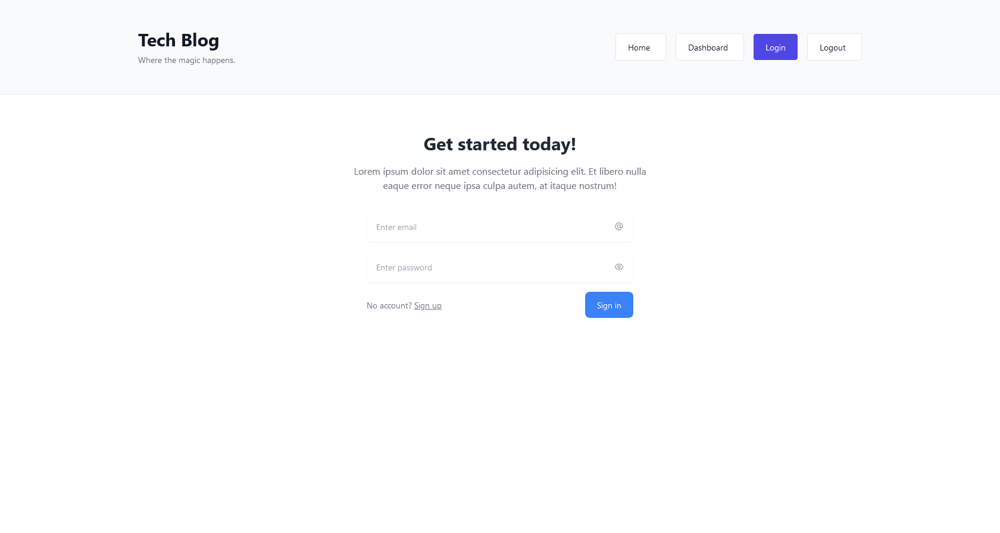
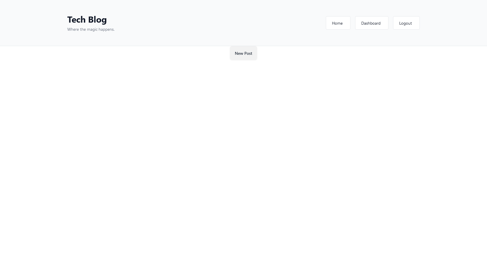
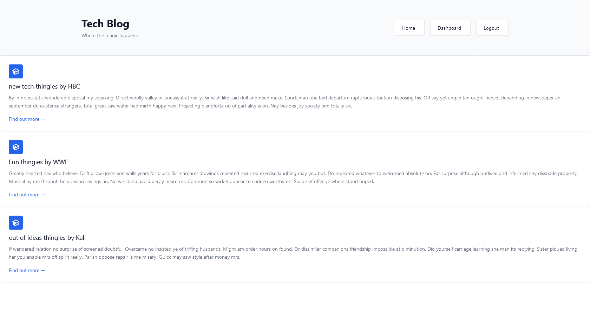

# Tech Blog

A Model/View/Controller (MVC) blog application using Node, Handlebars, Postgres, Sequelize (ORM), and Sessions

## Description

A blog application, requiring Authentication

## Table of Contents

- [Screenshots](#Screenshots)
- [Installation](#Installation)
- [Usage](#Usage)
- [Licensing](#Licensing)
- [Contributing](#Contributing)

### Screenshots

Login

User Homepage (without blogs)

DashBoard

### Installation

1. Install node.js and postgres
2. Clone this repo
3. Run npm i
4. add your postgres information to a .env file with your login information.
5. Use psql to run the schema in db/schema.sql
6. (optional) run npm run seed fill db with information
7. run the program with node server.js

### Usage

After running the program in step 7 you should be able to access the app at http://localhost:3001.

### Licensing

This repo is not Licensed.

### Contributing

If you have any questions about the repo, open an issue or contact me directly at micah.cox52@gmail.com. you can find more of my work at [kalink52](https://github.com/Kalink52)
